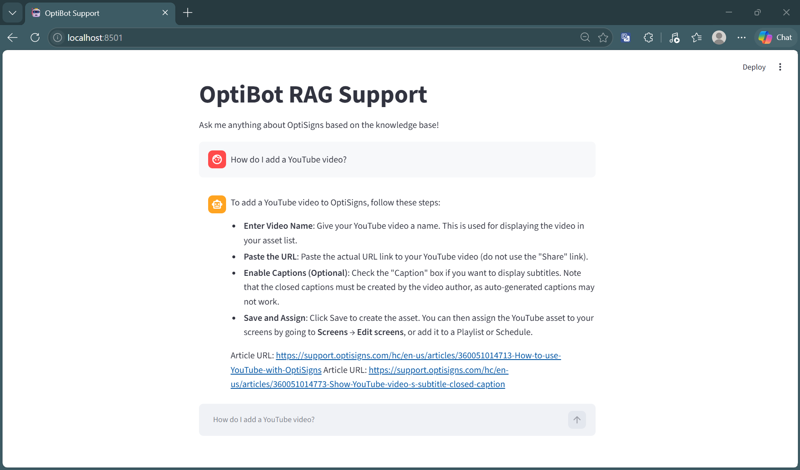

# Support Bot RAG Pipeline



This is a test submission for building a Retrieval-Augmented Generation (RAG) pipeline for support articles. The project includes scraping, vector indexing, a terminal chat interface, and a deployment configuration for daily updates.

## Architecture
1. **Scraper**: Pulls support articles via API, converts HTML to Markdown, and calculates content hashes to detect changes.
2. **Indexer**: Uses `sentence-transformers/all-MiniLM-L6-v2` to locally embed articles and stores them in ChromaDB. Only new or updated articles (delta) are processed.
3. **Chat**: Terminal interface that retrieves relevant chunks from ChromaDB and uses Gemini to generate accurate, cited answers.
4. **Daily Job**: Dockerized and scheduled via GitHub Actions to run daily, update the vector DB, and commit the delta changes.

## Setup Instructions

### 1. Requirements
- Python 3.10+
- Google Gemini API Key

### 2. Environment Configuration
Create a `.env` file in the root directory:
```env
GEMINI_API_KEY="your_api_key_here"
```

### 3. Install Dependencies
```bash
python -m venv venv
source venv/bin/activate  # Windows: venv\Scripts\activate
pip install -r requirements.txt
```

## Usage

Use the `main.py` script to run different parts of the pipeline:

**1. Scrape Knowledge Base**
Downloads and converts articles to markdown.
```bash
python main.py scrape
```

**2. Index to Vector DB**
Generates local embeddings and upserts only new/updated articles into ChromaDB.
```bash
python main.py index
```

**3. Run Chatbot (Terminal)**
Starts the interactive terminal chat.
```bash
python main.py chat
```

**4. Run Web UI (Streamlit)**
Starts a modern web-based chat interface.
```bash
python main.py ui
```

## Run via Docker

You can run the pipeline using Docker without needing Python installed locally.

**1. Build the Docker Image**
```bash
docker build -t optibot .
```

**2. Batch Pipeline**

Run the scraper and incremental indexer once.

```bash
docker run \
  --env-file .env \
  -v ${PWD}/chroma_db:/app/chroma_db \
  optibot
```

This command:
- Scrapes the latest OptiSigns articles
- Detects new or updated content
- Updates the local ChromaDB index
- Exits automatically

Alternatively, you can pass the API key directly:

```bash
docker run \
  -e GEMINI_API_KEY=your_key_here \
  -v ${PWD}/chroma_db:/app/chroma_db \
  optibot
```

**3. (Optional) Launch the Web UI**

```bash
docker run \
  -p 8501:8501 \
  --env-file .env \
  -v ${PWD}/chroma_db:/app/chroma_db \
  optibot ui
```

## Deployment (Daily Job)

The scraper is packaged using a `Dockerfile` and scheduled to run automatically once per day using GitHub Actions (`.github/workflows/daily_scrape.yml`). 

The scheduled job performs the following:
1. Builds the Docker container.
2. Re-scrapes the knowledge base.
3. Detects modifications (using `content_hash`).
4. Indexes only the delta inside the container.
5. Logs the execution counts (`New`, `Updated`, `Skipped`).
6. Mounts the volume and commits the updated `chroma_db` back to the repository to persist the database.

To manually trigger the job or view logs:
- Go to the **Actions** tab on GitHub.
- Select the **Daily Scraper and Indexer (Dockerized)** workflow.
- Click **Run workflow** or view past runs to see the log counts.
